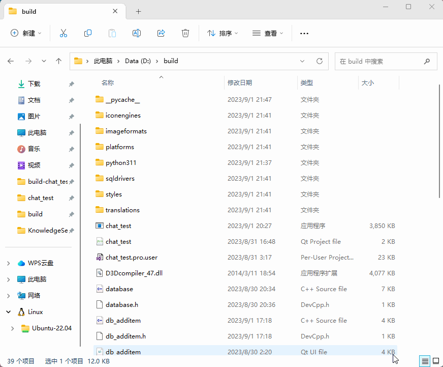

# KnowledgeSelf-test
基于GPT的个人知识库自测程序
# 项目背景
本人擅长通过不断地实践，来进行知识的学习，因此开发了这款知识自测软件。
...待续
# 演示动画
[
# 版本更新
1. 预计将对代码进行第一轮的优化
2. 预计添加 提交得分后 将本次答题记录保存到txt文件中
3. 预计添加 倒计时模式
4. 预计添加 通过网页管理知识条目数据库
5. ...待续
# 结语
本人发布的第一款软件，希望能打造的更好，希望能见证我的成长
